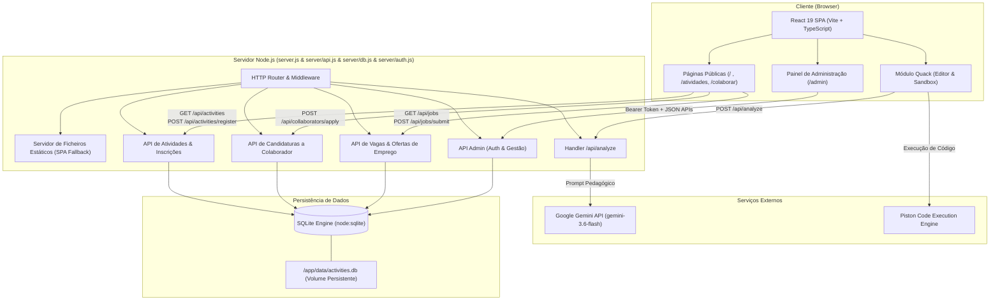
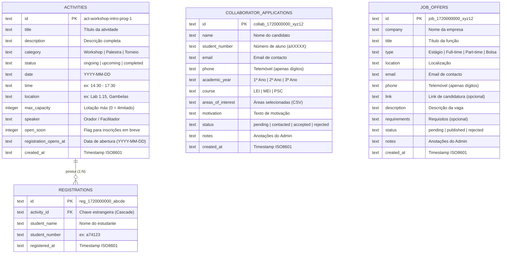
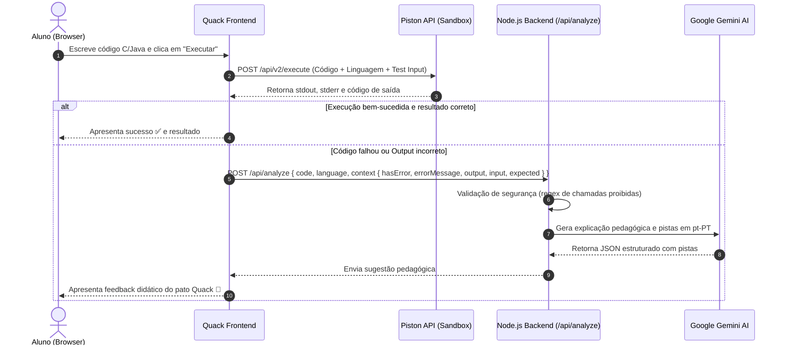

# 🌐 NEEI Web Portal & Quack 🦆

[](https://nodejs.org/)
[](https://react.dev/)
[](https://www.typescriptlang.org/)
[](https://vitejs.dev/)
[](https://tailwindcss.com/)
[](https://sqlite.org/)
[](https://ai.google.dev/)
[](https://coolify.io/)

Repositório oficial do portal web do **Núcleo de Estudantes de Engenharia Informática (NEEI)** da **Universidade do Algarve (UAlg)**, associado à **AAUAlg**.

O portal centraliza a comunicação com a comunidade académica, divulgação e gestão de atividades, receção de candidaturas a colaboradores, ofertas de emprego e estágio, projetos de estudantes e a plataforma **Quack** — um tutor interativo de programação com execução de código em tempo real e mentoria pedagógica por Inteligência Artificial.

---

## 📑 Tabela de Conteúdos

- [✨ Funcionalidades Principais](#-funcionalidades-principais)
  - [1. Quack (Tutor IA & Sandbox de Execução)](#1-quack-tutor-ia--sandbox-de-execução)
  - [2. Gestão de Atividades & Inscrições](#2-gestão-de-atividades--inscrições)
  - [3. Candidaturas a Colaborador](#3-candidaturas-a-colaborador)
  - [4. Painel de Administração (`/admin`)](#4-painel-de-administração-admin)
  - [5. Hub Académico & Comunidade](#5-hub-académico--comunidade)
- [📐 Arquitetura & Diagramas UML](#-arquitetura--diagramas-uml)
  - [Diagrama de Arquitetura do Sistema](#diagrama-de-arquitetura-do-sistema)
  - [Diagrama Entidade-Relacionamento (ERD)](#diagrama-entidade-relacionamento-erd)
  - [Diagrama de Sequência: Quack AI Tutor](#diagrama-de-sequência-quack-ai-tutor)
- [🛠️ Tecnologias](#️-tecnologias)
- [⚙️ Variáveis de Ambiente](#️-variáveis-de-ambiente)
- [🚀 Instalação & Execução Local](#-instalação--execução-local)
- [🐳 Deploy no Coolify (Docker & SQLite)](#-deploy-no-coolify-docker--sqlite)
- [🔒 Segurança](#-segurança)
- [📂 Estrutura do Projeto](#-estrutura-do-projeto)
- [📞 Contactos & Redes Oficiais](#-contactos--redes-oficiais)

---

## ✨ Funcionalidades Principais

### 1. Quack (Tutor IA & Sandbox de Execução) 🦆
- **Execução Real:** Compilação e execução isolada de código **C (GCC)** e **Java (OpenJDK)** através da API do [Piston](https://github.com/engineer-man/piston).
- **Tutor IA com Google Gemini:** Em caso de erro de sintaxe, compilação ou falha em casos de teste, o modelo Gemini analisa a falha e providencia explicações e pistas pedagógicas em Português de Portugal (pt-PT), estimulando o raciocínio sem entregar a solução pronta.
- **Banco de Exercícios Curriculares:** Exercícios organizados pelas unidades curriculares do curso de Engenharia Informática:
  - **PI** (Programação I)
  - **LP** (Laboratórios de Programação)
  - **AED** (Algoritmos e Estruturas de Dados)
  - **POO** (Programação Orientada a Objetos)
- **Validação Automática:** Testes de input/output integrados com feedback instantâneo.

### 2. Gestão de Atividades & Inscrições 📅
- **Calendário Público Dinâmico:** Visualização de eventos passados, presentes e futuros com data, hora, localização, orador e vagas disponíveis.
- **Inscrições Nativas:** Sistema de inscrição utilizando o número de estudante institucional UAlg (`aXXXXX`).
- **Data de Abertura Programada:** Suporte para indicação visual e temporizada de abertura de inscrições (*ex.: "Inscrições abrem a 28-09-2026"*).
- **Controlo de Visibilidade (`SHOW_CALENDAR`):** Variável de ambiente que permite ocultar temporariamente o calendário público antes de anúncios oficiais, mantendo o `/admin` totalmente operacional.

### 3. Candidaturas a Colaborador 🤝
- **Formulário Nativo (`/colaborar`):** Recolha de dados de identificação, contacto, percurso académico, áreas de interesse e texto de motivação.
- **Duração Curricular Específica por Curso:**
  - **LEI (Licenciatura em Eng. Informática):** 1º, 2º e 3º Ano.
  - **MEI (Mestrado em Eng. Informática):** 1º e 2º Ano.
  - **PSC (Pós-Graduação em Cibersegurança):** 1º Ano.
- **Validação Numérica de Contacto:** Campo de telemóvel restrito estritamente a números (dígitos).

### 4. Painel de Administração (`/admin`) 🛡️
- **Autenticação Segura:** Acesso protegido por palavra-passe (comparação em tempo constante) e tokens de sessão aleatórios de 256 bits com expiração de 7 dias.
- **Gestão de Atividades:** Criação, edição e eliminação em cascata de eventos.
- **Gestão de Inscritos:** Listagem de alunos por atividade, contador em tempo real, cópia de emails institucionais num clique e descarregamento de lista em formato `.csv`.
- **Pipeline de Colaboradores:** Acompanhamento de candidaturas com filtros por estado (*Pendente*, *Contactado*, *Aceite*, *Rejeitado*), pesquisa instantânea por texto, notas internas, exportação CSV e eliminação protegida por modal.

### 5. Hub Académico & Comunidade 🎓
- **Projetos:** Montra de projetos tecnológicos desenvolvidos pelos estudantes ligada diretamente ao repositório oficial no GitHub ([student-showcase](https://github.com/neei-aaualg/student-showcase)).
- **Recursos:** Repositório curado de apontamentos, provas-modelo e materiais de estudo.
- **Vagas:** Divulgação de ofertas de estágio e propostas de trabalho em empresas parceiras.
- **Órgãos Sociais:** Apresentação da direção e colaboradores com avatares e ligações diretas.

---

## 📐 Arquitetura & Diagramas UML

### Diagrama de Arquitetura do Sistema



---

### Diagrama Entidade-Relacionamento (ERD)



---

### Diagrama de Sequência: Quack AI Tutor



---

## 🛠️ Tecnologias

| Área | Tecnologia | Propósito |
| :--- | :--- | :--- |
| **Frontend** | [React 19](https://react.dev/) + [TypeScript](https://www.typescriptlang.org/) | Interface reativa, modular e tipada |
| **Build Tool** | [Vite 6](https://vitejs.dev/) | Compilação ultrarrápida e Hot Module Replacement (HMR) |
| **Estilos** | [Tailwind CSS 3](https://tailwindcss.com/) | Estilização utilitária responsiva com tema Dark/Light |
| **Ícones & UI** | [Lucide React](https://lucide.dev/) + [Canvas Confetti](https://www.npmjs.com/package/canvas-confetti) | Iconografia consistente e micro-interações visuais |
| **Backend** | [Node.js](https://nodejs.org/) (módulo nativo `node:http`) | Servidor web leve e de alta performance |
| **Base de Dados** | [SQLite](https://sqlite.org/) via [`node:sqlite`](https://nodejs.org/api/sqlite.html) | Persistência relacional embutida sem dependências externas |
| **Inteligência Artificial** | [Google Gemini Flash](https://ai.google.dev/) via `@google/genai` | Análise pedagógica de código e mentoria do Quack |
| **Sandbox de Código** | [Piston API](https://github.com/engineer-man/piston) | Execução segura e isolada de código C e Java |
| **Deploy & Hosting** | [Coolify](https://coolify.io/) + [Docker](https://www.docker.com/) | CI/CD automático e orquestração de contentores |

---

## ⚙️ Variáveis de Ambiente

Cria um ficheiro `.env` na raiz do projeto (para desenvolvimento local) ou configura as variáveis no painel da tua aplicação no **Coolify**:

| Variável | Obrigatória | Valor Padrão | Descrição |
| :--- | :---: | :--- | :--- |
| `PORT` | Não | `3000` | Porta em que o servidor HTTP irá escutar |
| `HOST` | Não | `0.0.0.0` | Endereço de interface de rede |
| `DATABASE_PATH` | Não | `data/activities.db` | Caminho para o ficheiro SQLite local (no Coolify: `/app/data/activities.db`) |
| `SHOW_CALENDAR` | Não | `true` | `true`/`1` para exibir o calendário no portal; `false`/`0` para exibir *"Calendário será anunciado brevemente..."* |
| `ADMIN_PASSWORD` | Não | `neei2026!` | Palavra-passe de acesso ao painel de administração (`/admin`) — define sempre em produção |
| `GEMINI_API_KEY` | Sim (p/ Quack) | — | Chave de API da Google Gemini (obtida gratuitamente no [Google AI Studio](https://aistudio.google.com/)) |

---

## 🚀 Instalação & Execução Local

### Pré-requisitos
- **Node.js:** versão 22 ou superior (necessária para suporte ao módulo nativo `node:sqlite`).
- **NPM** ou gerenciador de pacotes compatível.

### Passos de Configuração

1. **Clonar o Repositório:**
   ```bash
   git clone https://github.com/neei-aaualg/siteneei.git
   cd siteneei
   ```

2. **Instalar as Dependências:**
   ```bash
   npm install
   # No Windows PowerShell:
   npm.cmd install
   ```

3. **Configurar as Variáveis de Ambiente:**
   Cria o ficheiro `.env` com base no exemplo:
   ```env
   PORT=3000
   DATABASE_PATH=./data/activities.db
   SHOW_CALENDAR=true
   ADMIN_PASSWORD=minha_senha_segura
   GEMINI_API_KEY=tua_chave_do_google_ai_studio
   ```

4. **Executar em Modo de Desenvolvimento (Frontend Vite):**
   ```bash
   npm run dev
   # No Windows PowerShell:
   npm.cmd run dev
   ```

5. **Executar a Aplicação Fullstack (Produção Local):**
   ```bash
   npm run build && npm start
   # No Windows PowerShell:
   npm.cmd run build; npm.cmd start
   ```
   A aplicação estará acessível em `http://localhost:3000`.

---

## 🐳 Deploy no Coolify (Docker & SQLite)

O repositório está configurado para deploy contínuo através do **Coolify**. Cada push para a branch `main` (`origin/main`) desencadeia a compilação e publicação automática do contentor Docker.

### ⚠️ Configuração Obrigatória de Armazenamento Persistente (Volume)

Como o contentor Docker é efémero por padrão, o SQLite apagaria todas as inscrições e atividades a cada novo deploy se não for configurado um volume persistente:

1. No painel da aplicação no **Coolify**, acede ao separador **Storages** (ou **Persistent Storage**).
2. Adiciona um novo armazenamento persistente:
   - **Destination path:** `/app/data`
3. Desta forma, o ficheiro `/app/data/activities.db` permanece preservado de forma segura entre builds, atualizações de versão e reinícios do contentor.

---

## 🔒 Segurança

- **Sanitização de Código de Entrada:** Todas as submissões enviadas para o backend do Quack passam por filtros rigorosos para impedir comandos de sistema perigosos (`fork`, `system`, `Runtime.getRuntime`, acesso a sockets ou leitura de ficheiros do SO).
- **Isolamento em Sandbox:** O código dos utilizadores nunca é executado no mesmo ambiente da aplicação web, sendo canalizado para a API do Piston.
- **Proteção CSP (Content Security Policy):** Diretivas configuradas no `index.html` para prevenir vulnerabilidades de Cross-Site Scripting (XSS).
- **Sessões Administrativas Temporárias:** Tokens de sessão aleatórios com tempo de expiração, armazenados em memória e comparados de forma segura contra ataques de timing.

---

## 📂 Estrutura do Projeto

```text
siteneei/
├── App.tsx               # Rotas e providers globais da aplicação
├── index.tsx             # Ponto de entrada React
├── index.html            # Documento base HTML
├── components/           # Componentes reutilizáveis
│   ├── Header.tsx / Footer.tsx / Layout.tsx
│   ├── CalendarDropdown.tsx     # Dropdown de calendário das atividades
│   └── qrcodes/                 # Componentes de QR (QRPreview, NeeiPresentation, Toast)
├── constants/            # Dados estáticos (presets.ts - cartões QR oficiais)
├── context/              # Contextos React (ThemeContext - tema Dark/Light)
├── data/                 # Exercícios curriculares do Quack (PI, LP, AED, POO)
├── pages/                # Páginas principais da aplicação
│   ├── Home.tsx          # Página principal e destaques
│   ├── Events.tsx        # Calendário de atividades e inscrições
│   ├── Join.tsx          # Formulário de candidatura a colaborador
│   ├── Admin.tsx         # Dashboard administrativo (atividades, colaboradores & vagas)
│   ├── Quack.tsx         # Tutor de programação e editor interativo
│   ├── About.tsx         # Apresentação do núcleo e equipa
│   ├── Jobs.tsx          # Quadro de vagas e estágios
│   └── Links.tsx         # Apresentação QR das redes oficiais
├── server/               # Lógica de backend
│   ├── api.js            # Endpoints da API REST (atividades, admin, colaboradores, vagas)
│   ├── auth.js           # Autenticação e sessões administrativas
│   └── db.js             # Gestão da base de dados SQLite (node:sqlite) e queries
├── services/             # Clientes de comunicação com APIs
│   ├── activitiesService.ts   # Chamadas à API de atividades
│   ├── collaboratorsService.ts# Chamadas à API de colaboradores
│   ├── jobsService.ts         # Chamadas à API de vagas/emprego
│   └── geminiService.ts       # Execução Piston + integração com a API do Quack
├── types/                # Definições de tipos TypeScript
│   ├── types.ts          # Tipos partilhados (Language, ExecutionStatus)
│   ├── activities.ts     # Tipos de eventos, inscrições e admin
│   ├── collaborators.ts  # Tipos de candidaturas de colaboradores
│   ├── jobs.ts           # Tipos de ofertas de emprego
│   └── qrcode.ts         # Tipos de cartões QR
├── utils/                # Utilitários e formatadores de data/hora
├── Dockerfile            # Configuração de build e imagem Docker
├── server.js             # Servidor HTTP Node.js principal (+ /api/analyze)
├── vite.config.ts        # Configuração do Vite e plugins
└── package.json          # Metadados e dependências do projeto
```

---

## 📞 Contactos & Redes Oficiais

- 📧 **Email Oficial:** [neei@aaualg.pt](mailto:neei@aaualg.pt)
- 💬 **Discord:** [discord.gg/HzBuRFCAb5](https://discord.gg/HzBuRFCAb5)
- 📷 **Instagram:** [@neeiualg](https://instagram.com/neeiualg)
- 📘 **Facebook:** [NEEIUALG](https://www.facebook.com/NEEIUALG/)
- 💼 **LinkedIn:** [NEEI UAlg](https://www.linkedin.com/company/neeiualg)
- 🐙 **GitHub:** [github.com/neei-aaualg](https://github.com/neei-aaualg)

---

Desenvolvido e mantido com ❤️ pela equipa do **Núcleo de Estudantes de Engenharia Informática da AAUAlg**.